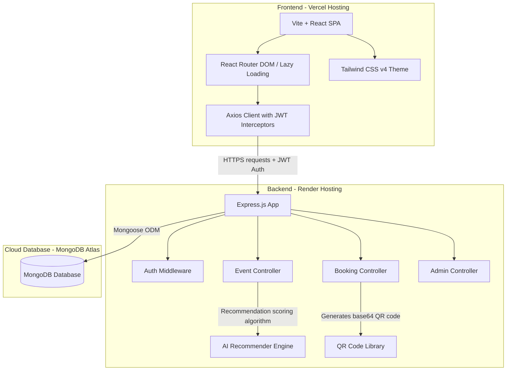

# EventMaster — Professional Event Management & Ticketing Portal

EventMaster is a production-grade, full-stack Event Management and Ticketing single-page application (SPA). The platform features dynamic ticket bookings (with auto-generated QR tickets), real-time search suggestions, administrative validation dashboards, and an AI-driven event recommendation engine based on user explicit interests and implicit viewing history.

---

## 🏗️ System Architecture

The project follows a decoupled client-server architecture deployed on **Vercel** and **Render** utilizing a cloud **MongoDB Atlas** database.



---

## ⚡ Performance Optimizations & Modern Touches

1. **Vite Code-Splitting:** Dynamic route imports using `React.lazy()` and `<React.Suspense>` are implemented to split the production bundle. Large libraries (like Recharts visual analytics and Framer Motion) are isolated inside their respective view chunks, reducing the initial bundle size from **890 kB** to **386 kB** (a ~56% reduction).
2. **Image Lazy Loading:** Standard and list view images throughout the catalog, admin panels, and tickets render with `loading="lazy"` tags to defer loading off-screen assets.
3. **UX Redirections:** Authentication gates store the request state dynamically; logging in or signing up redirects users back to their target view (e.g. event creation or booking) instead of defaulting to the home page.
4. **Vercel Rewrite Policies:** A `vercel.json` file controls routing rules so that deep URL routing reloads handle fallback requests gracefully without raising 404 errors.
5. **SEO Integration:** Structured HTML descriptions, keywords, social Open Graph meta tags, and high-quality favicons are set up.

---

## 🚀 Setup & Installation

### Prerequisites
- Node.js (v18 or higher)
- Local MongoDB or MongoDB Atlas cluster

### 1. Clone & Configuration
Configure environment variables:
- **Server:** Create `server/.env`:
  ```env
  PORT=5000
  MONGO_URI=mongodb://127.0.0.1:27017/eventmaster   # Replace with Atlas URI in production
  JWT_SECRET=your_jwt_secret_token
  ```
- **Client:** (Optional) Create `client/.env`:
  ```env
  VITE_API_URL=http://localhost:5000/api             # Replace with Render API URL in production
  ```

### 2. Install Dependencies
Run from the root directory:
```bash
# Install server dependencies
cd server && npm install

# Install client dependencies
cd ../client && npm install
```

### 3. Seed Database
Run the seed script in the `server` directory to populate users and preconfigured categories:
```bash
npm run seed
```
*Note: This deletes any existing events/users and seeds fresh mock databases.*

### 4. Running Locally
Run `start.bat` in the root directory to boot up both the Express backend and Vite frontend development server concurrently:
```bash
.\start.bat
```

---

## ☁️ Professional Production Deployment Guide

### Phase A: MongoDB Atlas (Database)
1. Register for a free tier at [MongoDB Atlas](https://www.mongodb.com/cloud/atlas).
2. Create a Shared Cluster and retrieve your Connection String.
3. Under **Network Access**, add IP address `0.0.0.0/0` to allow connections from Render hosting servers.
4. Create a database user with read/write privileges.

### Phase B: Render Deployment (Backend Server)
1. Sign in to [Render](https://render.com) and create a new **Web Service**.
2. Connect your GitHub repository.
3. Configure the following parameters:
   - **Root Directory:** `server`
   - **Build Command:** `npm install`
   - **Start Command:** `npm start`
4. Under **Environment Variables**, add:
   - `MONGO_URI` (Your MongoDB Atlas connection string)
   - `JWT_SECRET` (A strong random string)
   - `NODE_ENV` = `production`
5. Deploy and copy your generated Web Service URL (e.g. `https://eventmaster-backend.onrender.com`).

### Phase C: Vercel Deployment (Frontend Client)
1. Import your GitHub repository to [Vercel](https://vercel.com).
2. Configure project settings:
   - **Framework Preset:** `Vite`
   - **Root Directory:** `client`
   - **Build Command:** `npm run build`
   - **Output Directory:** `dist`
3. Under **Environment Variables**, add:
   - `VITE_API_URL` = `https://your-backend.onrender.com/api` (Render backend URL with `/api` suffix)
4. Click **Deploy**. Vercel will build the frontend chunks and host the SPA with client-side rewrites.

---

## 💼 Portfolio & Presentation Kit

Use the following outline for academic, client, or job-interview presentations.

### PowerPoint Slides Outline (10-Slide Structure)
1. **Title Slide:** EventMaster — Next-Generation Event Planner and Booking System.
2. **Problem Statement:** Challenges in local event discovery, manual tickets validation, and lack of personalized user recommendation.
3. **The Solution:** An all-in-one glassmorphism dashboard, secure ticketing with local QR rendering, and algorithmic event matching.
4. **Key Features:** Live search suggestions, user preference engine, creator review gates, and administrative analytics charts.
5. **System Architecture:** Decoupled React-Express architecture backed by MongoDB (with Mermaid graph).
6. **AI Recommender Algorithm:** Explained (interests vector + implicit view category history + tickets popularity scores).
7. **Performance & Optimizations:** Bundle size optimizations (code-splitting, lazy-loaded components), dynamic routing, and fast initial paint times.
8. **Security & Validation:** JWT authorization interceptors, secure route guards, and password hashing (bcryptjs).
9. **Deployment & DevOps:** High-availability deployment pipeline (Vercel, Render, MongoDB Atlas).
10. **Conclusion & Future Scope:** Automated email alerts, Stripe payment gateway integration, and calendar synching.
